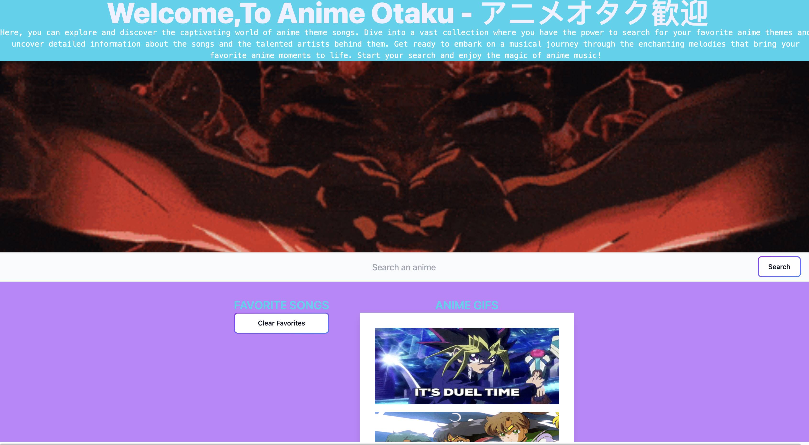
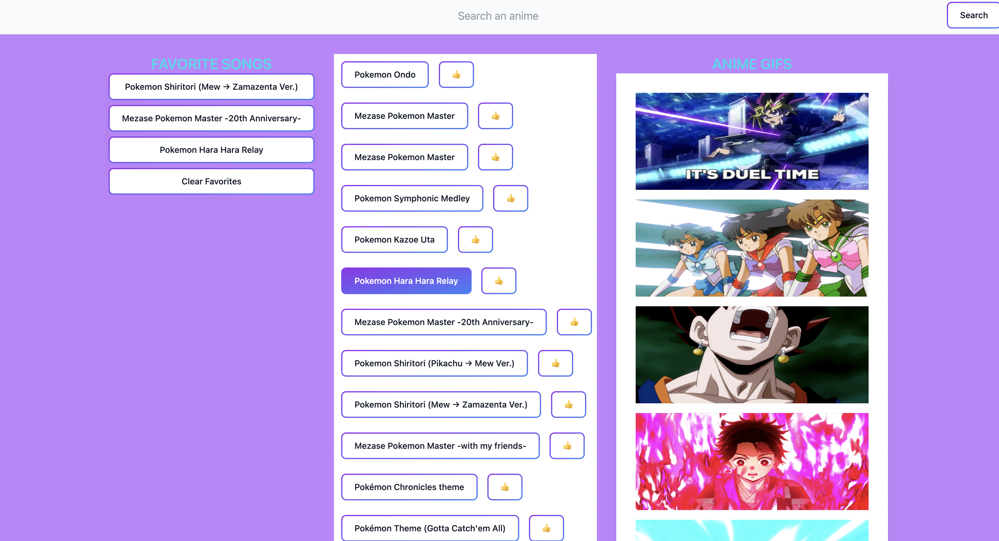
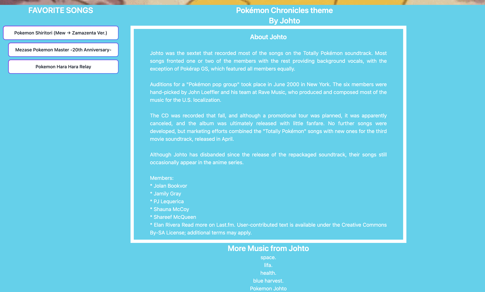

#  Anime Otaku
```
This is an interactive front-end group project.  This is an opportunity to show employers our collaborative skills and coding abilities.
```

## Application Description
```
This application provides an interactive anime theme search.  A user can search for anime theme songs and they will be provided with a a set of search results.  When the user chooses an anime, a new page comes up with the artist of that theme song of the anime.  There will be a header of the anime behind an image of the artist of the song.  The user will be able to see information about the artist as well as a few more songs from the artist if they are interested.  There will be a search option on this page just incase the user would want to search for another anime theme song.
```

## User Story
```
AS AN anime fan
I WANT to get more information about the artist of my favorite anime theme song
SO THAT I can learn more about their background and get a list of more songs from them
```

## Deployed Application
```
The application is hosted at: https://a-nord.github.io/Anime-Otaku/
```
## Usage

    1. You can search for any anime song that you want in the search bar. 


    2. Your search results will appear and you can click the like button to save it or click the name to get more info on the song.


    3. You will be directed to another page, where you can see the artist's bio, and some of their top songs.


## Directions For Future Development
```
We are excited about the continuous growth and expansion of our website. Looking ahead, we envision enriching our platform by incorporating more talented artists and diverse anime content. Our commitment to future development includes a focus on enhancing the user experience with a broader range of creators and engaging anime.  We also want to include the translations of the song lyrics from their original language to english.  We believe this expansion will not only meet the evolving interests of our audience but also contribute to the overall success and vitality of our platform.
```

## Tools Used
```
* HTML
* CSS (Tailwind)
* JavaScript
* jQuery
* two server-side Web APIs
```

## Collaboration
```
This application was created by Micheal Nguyen, Jazmin Nova, and Ashley Nord.
```


## Preview
<p align="center">
  
</p>